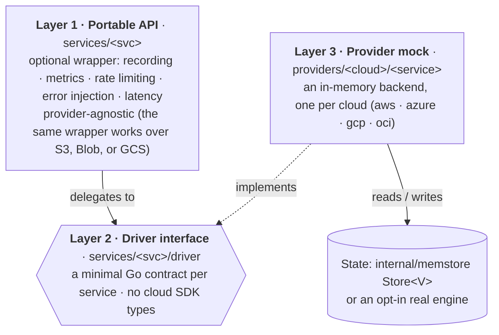
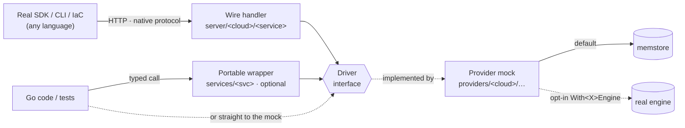
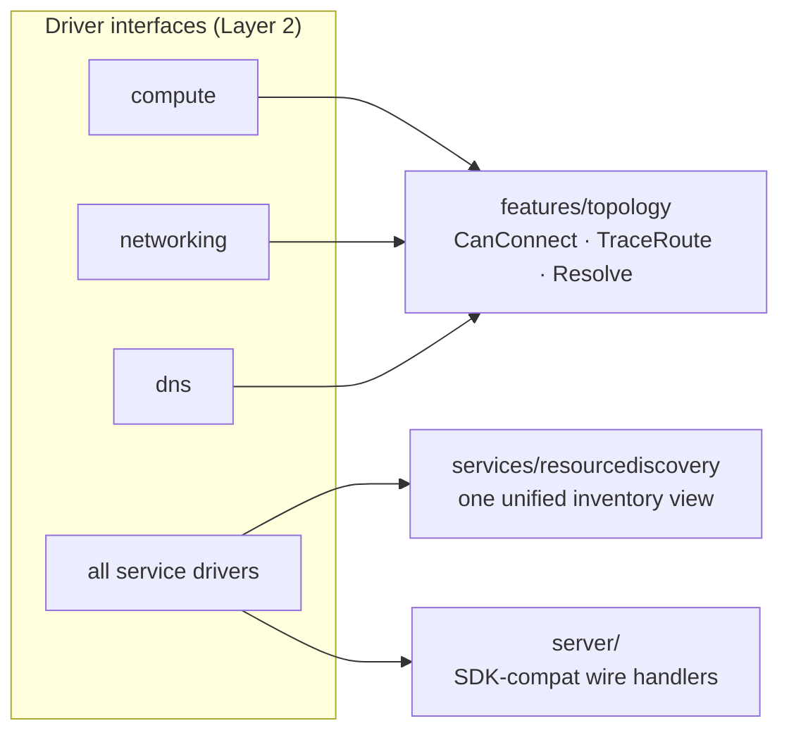

# Architecture

## Overview

CloudEmu keeps what a service does separate from which cloud provides it. There are three layers: a provider-agnostic portable API, a small driver interface per service, and an in-memory provider mock per cloud. Every provider implements the same driver interface, so the cross-cutting behaviors (recording, metrics, rate limiting, error injection, latency) and the wire servers work the same way for every cloud.

AWS, Azure and GCP are fully implemented. OCI is a fourth provider that is still being built (see [below](#fourth-provider-oci-in-progress)). The generated [capability coverage](coverage/README.md) is the source of truth for which services exist.

## The three layers



- Layer 1, portable API (`services/storage`, `services/compute`, `services/database`, …). Each portable type wraps a driver and adds the cross-cutting behaviors above to every call. It doesn't depend on a provider, and it is optional: wrap a driver with it when you want those behaviors. For example, `storage.Bucket` wraps any `driver.Bucket`, whether that is S3, Blob or GCS.
- Layer 2, driver interface (`services/<svc>/driver/driver.go`). This is the core of the design: a small Go interface listing the operations every provider must implement (`CreateBucket`, `PutObject`, …), using plain Go types. Everything that touches state goes through a driver.
- Layer 3, provider mock (`providers/{aws,azure,gcp,oci}/<service>`). The implementation for one cloud. It implements the driver interface and keeps state in `internal/memstore.Store[V]`, a generic thread-safe in-memory store, or in a [real engine](#real-data-plane-engines) if you opt in.

## How a call reaches state

There are two entry points, and both end at the driver interface:



- Standalone / SDK path. A real `aws-sdk-go-v2`, `azure-sdk-for-go` or `cloud.google.com/go` client (or a CLI, or an IaC tool) sends an HTTP request in the cloud's native wire format. The matching wire handler decodes it and calls the driver. You only change the client's endpoint. See [sdk-server.md](sdk-server.md) and [standalone-server.md](standalone-server.md).
- Typed Go path. `cloudemu.NewAWS().S3.CreateBucket(...)` calls a provider mock (a driver implementation) directly. Wrap it in the portable API first (`storage.New(mock, …)`) if you want recording, metrics, rate limiting, injection or latency on those calls.

In both cases the request reaches the driver interface, the provider mock handles it, and state lives in `memstore` unless a real engine is wired in.

## Real data-plane engines

Normally the provider mock's data path is `memstore`. Passing a `config.With<X>Engine` option sends that path to an opt-in real engine instead: real Postgres/MySQL, Redis, function runtimes, Docker compute/containers, or filesystem-backed object bytes. Clients then run real workloads against the emulator. If you don't set one (the default), everything stays in memory. Engine code lives in the sibling modules `contrib/realengine` (no Docker) and `contrib/dockerengine` (Docker). `Provider.Close()` shuts down every wired engine via `Options.EngineClosers()`. The full list is in [features.md: Real Data-Plane Engines](features.md#11-real-data-plane-engines-opt-in).

## Cross-service engines

Some features need to read several drivers at once. They sit next to the portable API and use the Layer 2 interfaces directly (never concrete provider types), which is why they work the same across clouds:



- `features/topology` reads the compute, networking and DNS drivers to work out network reachability. See [topology.md](topology.md).
- `services/resourcediscovery` walks every driver a provider holds and returns one normalized inventory. It backs AWS Resource Explorer, Azure Resource Graph and GCP Cloud Asset. See [features.md](features.md#10-cross-service-resource-discovery).
- `server/` exposes drivers over HTTP in each cloud's native wire format. It uses a pluggable `Handler` registry, so each new service is a self-contained package. The billing/FinOps APIs also live here (`server/aws/{costexplorer,savingsplans,servicequotas}`, `server/azure/costmanagement`, `server/gcp/cloudbilling`), all served from the `services/cost`/`services/pricing` model. The shared `server/serverkit` assembly wraps each provider handler with optional middleware (`features/vcr` record/replay) and mounts the `features/timetravel` save/rewind/fork routes under the `/_cloudemu` admin plane. See [sdk-server.md](sdk-server.md).

## Provider factory and cross-service wiring

Each provider has a factory (`New()` in `providers/aws/aws.go`, etc.). It reads the `config.Option` values, creates every service mock with the shared options, wires up the cross-service dependencies, and returns a `Provider` struct whose services are public fields.

```go
aws := cloudemu.NewAWS(config.WithRegion("us-west-2"))
defer aws.Close()                       // tears down any wired real engines

aws.S3.CreateBucket(ctx, "my-bucket")
aws.EC2.RunInstances(ctx, instanceConfig, 1)
```

The main piece of wiring is auto-metrics. `SetMonitoring()` connects a service to its monitoring backend at construction time, so a launched VM pushes metrics into CloudWatch, Azure Monitor or Cloud Monitoring.

```go
p.EC2.SetMonitoring(p.CloudWatch)          // AWS
p.VirtualMachines.SetMonitoring(p.Monitor) // Azure
p.GCE.SetMonitoring(p.CloudMonitoring)     // GCP
```

On every provider, Compute, Storage, Database, Serverless, Message Queue, Cache, Logging, Notification, Container Registry and Event Bus push auto-metrics this way. Some services beyond these are wired too (on AWS, for example, RDS, Redshift, EKS and SageMaker). The factory files have the full list.

## Package map

| Package | Purpose |
|---------|---------|
| `config` | Functional options (`WithClock`/`WithRegion`/`WithAccountID`/`WithProjectID`/`WithLatency`, the `With<X>Engine` engine options), the `Clock` interface, and `FakeClock` for deterministic time |
| `errors` | Canonical error codes: `NotFound`, `AlreadyExists`, `InvalidArgument`, `FailedPrecondition`, `PermissionDenied`, `Throttled`, `Internal`, … |
| `internal/memstore` | Generic thread-safe `Store[V]`, the backing store for every mock |
| `internal/idgen` | ID generators: AWS ARNs, Azure resource IDs, GCP self-links, OCIDs |
| `statemachine` | Generic FSM for VM lifecycle transitions (pending → running → stopping → …) |
| `pagination` | Generic `Paginate[T]` with base64 page tokens |
| `features/{recorder,metrics,ratelimit,inject,chaos,topology,vcr,timetravel,quota}` | The cross-cutting behaviors and cross-service engines, including `vcr` (record/replay the wire protocol), `timetravel` (named state save/rewind/fork) and `quota` (per-service quota and increase-request registry) |
| `services/cost`, `services/pricing` | Cost modeling: a per-operation `cost.Tracker`, a resource-inventory `cost.Estimate`/commitment model, and the `services/pricing` rate tables that feed it |

The source tree follows the layers: `services/<svc>/` (portable API + `driver/`), `providers/<cloud>/<service>/` (mocks), `server/<cloud>/<service>/` (wire handlers), plus the `contrib/*` sibling modules. See [STRUCTURE.md](STRUCTURE.md) for the full layout, naming rules, and where new code goes.

## Concurrency and thread safety

Mocks get concurrent traffic: the wire server handles requests on many goroutines, and SDK/CLI callers fan out. `internal/memstore.Store[V]` only makes the map operations (`Get`/`Set`/`Delete`/`All`/…) atomic. When a store holds pointers (`Store[*fooData]`), the struct behind the pointer has no synchronization of its own. Two goroutines changing the same entity's fields, or one writing while another reads, is a data race.

For any entity stored as a pointer and changed after it is first put in the store:

- Give the stored struct its own `sync.Mutex` (or `RWMutex`) and hold it around every read and write of its mutable fields. See `providers/aws/sqs.queueData.mu` for an example. `providers/aws/ec2.instanceData.mu` does the same, and also updates the readable `State` field under the lock in step with the authoritative `statemachine.Machine` transition. Fully initialize an entity before you `Set` it into the store, so a concurrent reader never sees a half-written struct.
- Or make the change through `memstore.Store.Update(key, fn)`, which does the read-modify-write while holding the store lock.

Don't "update" shared state with `v, _ := store.Get(k); mutate(v); store.Set(k, v)`. Besides the field-level race, `Get` followed by `Set` loses updates: two callers read the same value, each changes its copy, and the second `Set` overwrites the first. The `-race` detector doesn't catch this, because there is no conflicting access to the same memory address, so CI won't flag it. Use `Update` or a per-entity lock.

CI has a `Race` job. On pull requests it runs a fast subset under `-race`, and the full `go test -race ./...` sweep runs nightly (#587).

## Fourth provider: OCI (in progress)

OCI (`providers/oci/`) has the same three-layer shape: a `memstore`-backed mock per service that implements the shared driver, plus a `server/oci/<service>/` handler. The foundation is in place: identity options, OCID generation in `internal/idgen/ocid.go`, `services/scope` compartment scoping, the `server/wire/ocirest` format, and the `server/oci/workrequest` async envelope. Services are added one PR at a time; see [oci-conventions.md](oci-conventions.md).

Until every service is in, OCI differs in two documented ways:

- The provider is only partly populated. `providers/oci.Provider` declares each service as a bare driver interface, so a service that hasn't been added yet is `nil` instead of a compile error. The generated [capability coverage](coverage/README.md) is the source of truth for what exists.
- Resource discovery has no OCI branch. The ARN/ID formatters in `services/resourcediscovery` fall through to a default for OCI, so discovery doesn't return native OCIDs yet. This will be filled in as services that produce discoverable resources are added.
