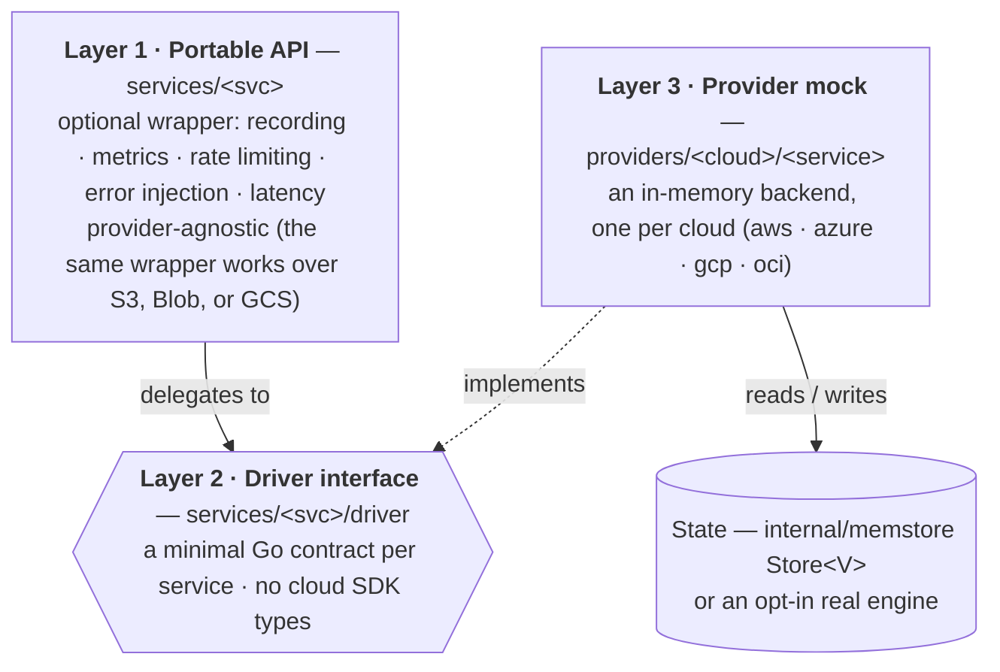
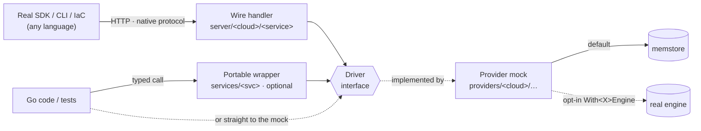
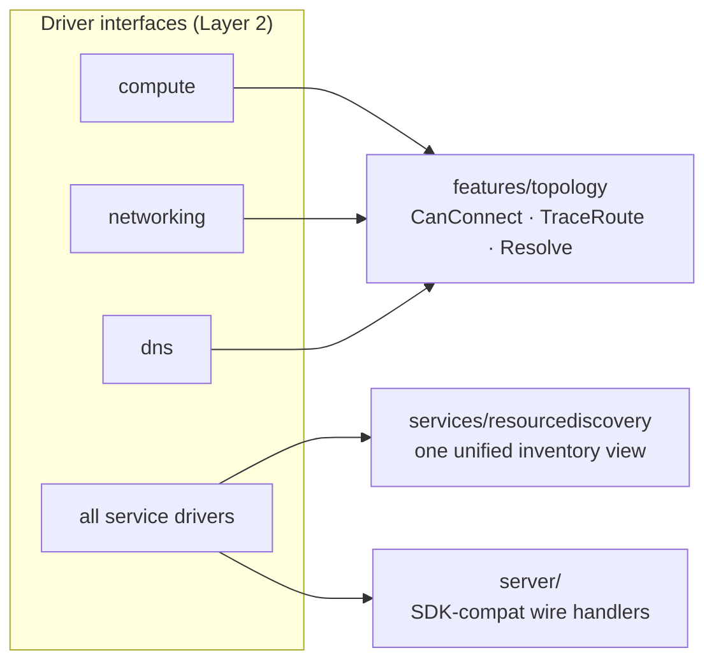

# Architecture

## Overview

CloudEmu separates **what** a cloud service does from **which** cloud does it, in three layers: a provider-agnostic **portable API**, a minimal **driver interface** per service, and an in-memory **provider mock** per cloud. Every provider implements the same driver interface, so one set of cross-cutting behaviors (recording, metrics, rate limiting, error injection, latency) and one set of wire servers work uniformly across clouds.

AWS, Azure, and GCP are fully implemented; **OCI** is an in-progress fourth provider (see [below](#fourth-provider-oci-in-progress)). The generated [capability coverage](coverage/README.md) is the source of truth for which services exist.

## The three layers



- **Layer 1 — Portable API** (`services/storage`, `services/compute`, `services/database`, …). Each portable type wraps a driver and adds the cross-cutting concerns above to every call. It is provider-agnostic and **optional**: you wrap a driver with it when you want those behaviors. For example `storage.Bucket` wraps any `driver.Bucket` — S3, Blob, or GCS.
- **Layer 2 — Driver interface** (`services/<svc>/driver/driver.go`). The hinge of the whole design: a minimal Go interface listing the operations every provider must implement (`CreateBucket`, `PutObject`, …), using plain Go types. Everything that reaches state goes through a driver.
- **Layer 3 — Provider mock** (`providers/{aws,azure,gcp,oci}/<service>`). The concrete implementation for one cloud. It implements the driver interface and stores state in `internal/memstore.Store[V]` — a generic, thread-safe in-memory store — or, when opted in, a [real engine](#real-data-plane-engines).

## How a call reaches state

There are **two ways in**, and both converge on the driver interface:



- **Standalone / SDK path** — a real `aws-sdk-go-v2`, `azure-sdk-for-go`, or `cloud.google.com/go` client (or a CLI, or IaC) sends an HTTP request in the cloud's native wire format. The matching **wire handler** decodes it and calls the driver. Point the client at the endpoint; nothing else changes. See [sdk-server.md](sdk-server.md) and [standalone-server.md](standalone-server.md).
- **Typed Go path** — `cloudemu.NewAWS().S3.CreateBucket(...)` calls a provider mock (a driver implementation) directly. Wrap it in the portable API first (`storage.New(mock, …)`) when you want recording/metrics/rate-limiting/injection/latency on those calls.

Either way the request lands on the **driver interface**, the provider mock services it, and state lives in `memstore` — unless a real engine is wired in.

## Real data-plane engines

The provider mock's data path is normally `memstore`. Passing a `config.With<X>Engine` option routes that path through an **opt-in real engine** instead — real Postgres/MySQL, Redis, function runtimes, Docker compute/containers, or filesystem-backed object bytes — so clients run real workloads against the emulator. Unset (the default) keeps everything in-memory. Engine code lives in sibling modules `contrib/realengine` (no Docker) and `contrib/dockerengine` (Docker); `Provider.Close()` tears every wired engine down via `Options.EngineClosers()`. Full catalog: [features.md — Real Data-Plane Engines](features.md#11-real-data-plane-engines-opt-in).

## Cross-service engines

Some features need to read **several** drivers at once, so they sit beside the portable API and consume Layer 2 interfaces directly (never concrete provider types), which is why they work uniformly across clouds:



- **`features/topology`** — reads compute, networking, and DNS drivers to evaluate real network reachability. See [topology.md](topology.md).
- **`services/resourcediscovery`** — walks every driver a provider holds and returns one normalized inventory (backs AWS Resource Explorer, Azure Resource Graph, GCP Cloud Asset). See [features.md](features.md#10-cross-service-resource-discovery).
- **`server/`** — exposes drivers over HTTP in each cloud's native SDK wire format, via a pluggable `Handler` registry so new services drop in as self-contained packages. This is also where billing/FinOps surfaces live (`server/aws/{costexplorer,savingsplans,servicequotas}`, `server/azure/costmanagement`, `server/gcp/cloudbilling`), all served from the `services/cost`/`services/pricing` model. The shared `server/serverkit` assembly wraps each provider handler with optional middleware — `features/vcr` record/replay — and mounts the `features/timetravel` save/rewind/fork routes under the `/_cloudemu` admin plane. See [sdk-server.md](sdk-server.md).

## Provider factory & cross-service wiring

Each provider has a factory (`New()` in `providers/aws/aws.go`, etc.) that reads `config.Option` values, instantiates every service mock with the shared options, **wires cross-service dependencies**, and returns a `Provider` struct whose services are public fields.

```go
aws := cloudemu.NewAWS(config.WithRegion("us-west-2"))
defer aws.Close()                       // tears down any wired real engines

aws.S3.CreateBucket(ctx, "my-bucket")
aws.EC2.RunInstances(ctx, instanceConfig, 1)
```

The key wiring is auto-metrics: `SetMonitoring()` connects a service to its monitoring backend at construction, so a launched VM pushes metrics straight into CloudWatch / Azure Monitor / Cloud Monitoring.

```go
p.EC2.SetMonitoring(p.CloudWatch)          // AWS
p.VirtualMachines.SetMonitoring(p.Monitor) // Azure
p.GCE.SetMonitoring(p.CloudMonitoring)     // GCP
```

10 services per provider push auto-metrics this way: Compute, Storage, Database, Serverless, Message Queue, Cache, Logging, Notification, Container Registry, and Event Bus.

## Package map

| Package | Purpose |
|---------|---------|
| `config` | Functional options (`WithClock`/`WithRegion`/`WithAccountID`/`WithProjectID`/`WithLatency`, the `With<X>Engine` engine options), the `Clock` interface, and `FakeClock` for deterministic time |
| `errors` | Canonical error codes: `NotFound`, `AlreadyExists`, `InvalidArgument`, `FailedPrecondition`, `PermissionDenied`, `Throttled`, `Internal`, … |
| `internal/memstore` | Generic thread-safe `Store[V]` — the backing store for every mock |
| `internal/idgen` | ID generators: AWS ARNs, Azure resource IDs, GCP self-links, OCIDs |
| `statemachine` | Generic FSM for VM lifecycle transitions (pending → running → stopping → …) |
| `pagination` | Generic `Paginate[T]` with base64 page tokens |
| `features/{recorder,metrics,ratelimit,inject,chaos,topology,vcr,timetravel,quota}` | The cross-cutting behaviors and cross-service engines — including `vcr` (record/replay the wire protocol), `timetravel` (named state save/rewind/fork), and `quota` (per-service quota + increase-request registry) |
| `services/cost`, `services/pricing` | Cost modeling: a per-operation `cost.Tracker`, a resource-inventory `cost.Estimate`/commitment model, and the `services/pricing` rate tables that feed it |

The source tree mirrors the layers — `services/<svc>/` (portable API + `driver/`), `providers/<cloud>/<service>/` (mocks), `server/<cloud>/<service>/` (wire handlers) — plus the `contrib/*` sibling modules. See [STRUCTURE.md](STRUCTURE.md) for the full layout, naming rules, and where new code goes.

## Concurrency & thread safety

Mocks are hit concurrently — the wire server serves requests on many goroutines, and SDK/CLI callers fan out. `internal/memstore.Store[V]` makes only the **map operations** (`Get`/`Set`/`Delete`/`All`/…) atomic. When a store holds pointers (`Store[*fooData]`), the pointed-to struct has **no** synchronization of its own: two goroutines mutating the same entity's fields, or one mutating while another reads, is a data race.

So the rule for any entity that is stored as a pointer and mutated after it is first put in the store:

- **Give the stored struct its own `sync.Mutex` (or `RWMutex`) and hold it around every read and write of its mutable fields.** The exemplar is `providers/aws/sqs.queueData.mu`; `providers/aws/ec2.instanceData.mu` follows the same pattern (it also keeps the readable `State` field in lockstep, under the lock, with the authoritative `statemachine.Machine` transition). Initialize an entity fully **before** `Set`-ing it into the store, so a concurrent reader can never observe a half-written struct.
- **Or** apply the change through `memstore.Store.Update(key, fn)`, which performs the read-modify-write while holding the store lock.

Never do `v, _ := store.Get(k); mutate(v); store.Set(k, v)` as a way to "update" shared state. Beyond the field-level race, `Get`-then-`Set` is a **lost-update** race: two callers read the same value, each mutates its copy, and the second `Set` silently clobbers the first. This is a logical check-then-act race that the `-race` detector does **not** catch (no conflicting memory access on the same address), so it will not show up in CI — use `Update` or a per-entity lock instead.

A blocking `go test -race ./...` job runs in CI (the `Race` gate): the tree is race-clean, so any newly introduced data race fails the build (#587).

## Fourth provider: OCI (in progress)

OCI (`providers/oci/`) follows the same three-layer shape: a `memstore`-backed mock per service implementing the shared driver, plus a `server/oci/<service>/` handler. Its foundation is in place (identity options, OCID generation in `internal/idgen/ocid.go`, `services/scope` compartment scoping, the `server/wire/ocirest` format, and the `server/oci/workrequest` async envelope); services land one PR at a time — see [oci-conventions.md](oci-conventions.md).

Until every service has landed, OCI diverges in two documented ways:

- **Partially populated provider** — `providers/oci.Provider` declares each service as a bare driver interface, so a service that hasn't landed reads as `nil` rather than failing to compile. The generated [capability coverage](coverage/README.md) is the source of truth for what exists.
- **No OCI branch in resource discovery** — the ARN/ID formatters in `services/resourcediscovery` fall through to a default for OCI, so its resources don't yet get native OCIDs from discovery. This fills in alongside the services that produce discoverable resources.
